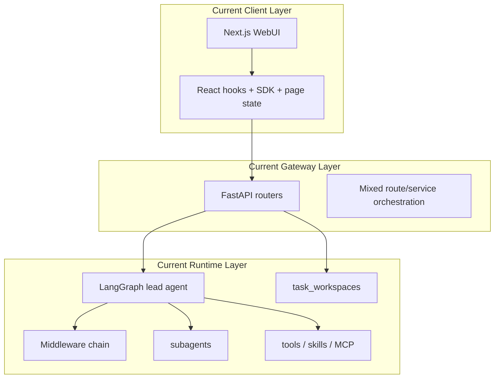
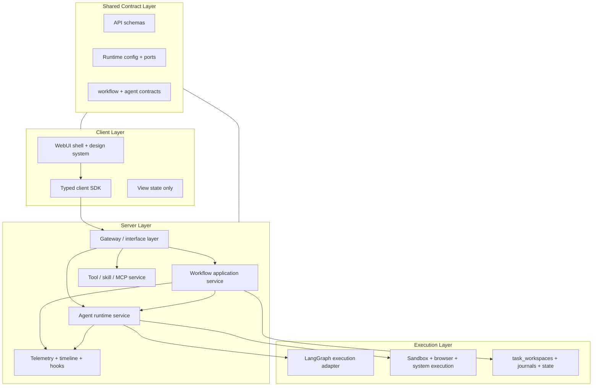
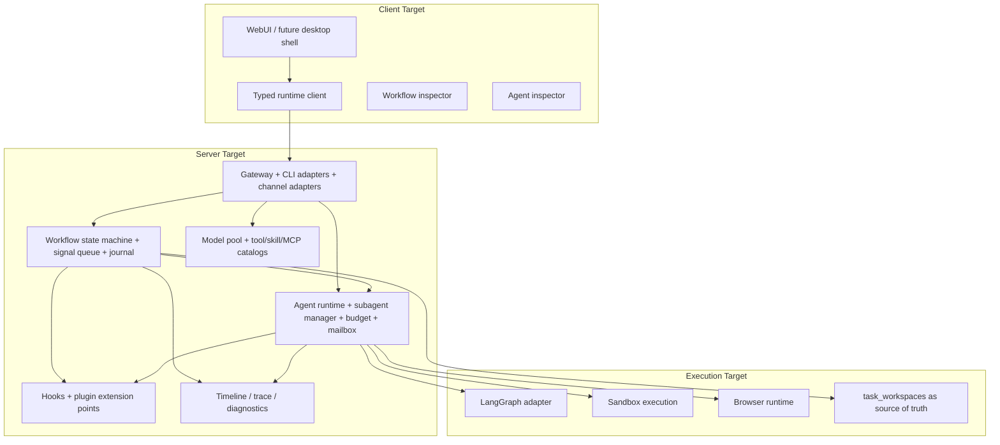

# OctoAgent System Refactor Master Plan

Last Updated: 2026-04-12
Status: Active
Primary Goal: complete the 3.x architecture transition without changing the established WebUI visual language

## 1. Executive Summary

This document turns the 2026-04-12 external-project research into the active OctoAgent refactor program.

The core decision is:

1. Preserve the existing WebUI design system and user-facing interaction patterns unless a runtime mismatch forces a narrow UI adjustment.
2. Split the system more explicitly into client, server, and shared-contract layers.
3. Treat task_workspaces as the single source of truth for workflow runtime state.
4. Upgrade agent execution from chat-attached behavior to a managed runtime with explicit sessions, budgets, and lifecycle.
5. Keep frontend, gateway, CLI, scripts, ports, and deployment entrypoints synchronized through shared contracts and generated/runtime-configured defaults.

This refactor borrows selectively from:

1. OpenAkita: agent runtime governance, skills/MCP/tool catalogs, plugin hooks, task scheduler, self-check loop.
2. Hermes Agent Solution Template: durable workflow state, human-in-the-loop signaling, auditability, long-running execution semantics.
3. Rowboat: unified workflow studio, playground debugging, copilot-assisted workflow authoring, external runtime APIs, Python SDK, widget and connector surfaces.
4. Existing OctoAgent repository strengths: current Gateway + LangGraph runtime, task workspace foundation, runtime workspace model, validated WebUI baseline, existing tool and middleware investments.

## 2. Research Findings Incorporated

### 2.1 Cross-project findings

1. OpenAkita is the strongest local reference for platform-style agent runtime, multi-agent coordination, tools/skills/MCP governance, hooks, scheduler, and controlled self-evolution.
2. Hermes is the strongest local reference for durable workflow orchestration, wait/signal semantics, retry discipline, and execution auditability.
3. Onyx, Codex, Godogen, and Vibe Motion provide useful isolated skill or MCP patterns, but not a complete runtime model for OctoAgent.

### 2.2 Direct implications for OctoAgent

1. Do not attempt a big-bang replacement of LangGraph, Gateway, or the current WebUI shell.
2. Introduce explicit runtime boundaries first, then migrate execution logic behind facades.
3. Make workflow truthfulness a hard invariant: UI, API, runtime, and persisted state must agree.
4. Make ports, entrypoints, and public URLs centrally governed, not scattered across frontend, backend, shell scripts, nginx, and docker.
5. Prepare a studio-grade runtime surface so future builder, widget, SDK, and channel-binding work lands on explicit contracts rather than ad hoc page payloads.

## 3. Architectural Direction

### 3.1 Current Layer

Current problems:

1. Workflow truth is split between frontend snapshots, gateway routes, LangGraph threads, and task_workspaces.
2. Agent execution is still too chat/thread attached.
3. Ports and runtime entrypoints are duplicated in multiple layers.
4. CLI, WebUI, and gateway do not yet consume a single runtime contract surface.

### 3.2 Transition Layer

### 3.3 Target Layer

## 4. Server / Client Separation Plan

### 4.1 Client responsibilities

The client layer must contain only:

1. Page composition and preserved visual design language.
2. Typed API clients and SSE/WebSocket consumers.
3. View-state and optimistic UX state.
4. Workflow and agent inspectors that render server truth, not local inferred truth.

The client layer must not own:

1. Workflow execution decisions.
2. Agent lifecycle truth.
3. Hidden fallback routing logic for ports or service topology beyond shared runtime config.

### 4.2 Server responsibilities

The server layer must own:

1. Workflow state machine, compile/run/resume/signal semantics.
2. Agent runtime lifecycle, budgets, handoffs, cancellation, mailbox, concurrency limits.
3. Tool/skill/MCP registration and availability policies.
4. Runtime observability and audit timelines.
5. CLI and WebUI parity through the same application services.

### 4.3 Shared layer responsibilities

The shared layer must own:

1. Port layout and public runtime endpoints.
2. API contracts and schema compatibility.
3. Workflow and agent contract types.
4. Cross-layer enum/status vocabulary.

## 5. Module Mapping

### 5.1 Preserve as-is unless needed for adapter work

1. frontend visual design system and workspace presentation components.
2. frontend route hierarchy and established interaction flows.
3. backend LangGraph adapter entrypoints until WorkflowCore and AgentCore facades are fully in place.

### 5.2 Refactor into WorkflowCore

1. backend/src/task_workspaces
2. backend/src/orchestration
3. workflow-related gateway routers
4. task execution status projection logic

### 5.3 Refactor into AgentCore

1. backend/src/agents
2. backend/src/subagents
3. runtime execution/session binding code currently split across query engine and task execution

### 5.4 Refactor into CapabilityCore

1. backend/src/models
2. backend/src/tools
3. backend/src/tools_registry
4. backend/src/skills
5. backend/src/mcp
6. plugin capability exposure

### 5.5 Refactor into Interface

1. backend/src/gateway
2. backend/src/interface_layer
3. CLI execution surfaces
4. channel adapters and external integration ingress points

## 6. API and Contract Plan

### 6.1 New contract families

1. RuntimeConfigContract: ports, base URLs, service topology.
2. WorkflowRuntimeContract: workflow status, node state, signal waits, retry info, timeline references.
3. AgentRuntimeContract: active agents, sessions, budgets, mailbox, handoffs, model chain.
4. CapabilityContract: tools, skills, MCP servers, model capabilities.

### 6.2 API rules

1. Workflow detail pages, chat-side workflow panels, and CLI commands must consume the same task_workspaces-backed runtime API.
2. Any port change must be reflected via shared runtime config into frontend, scripts, gateway defaults, smoke tooling, and nginx.
3. Public API shape changes must ship with backward-compatible gateway facades first.

## 7. Execution Plan

### Phase 0: foundation already started in this session

1. Add a shared runtime port baseline.
2. Wire frontend/backend/local scripts/nginx/docker to the same baseline.
3. Record the refactor strategy in project docs and repo memory.

### Phase 1: workflow truth consolidation

Acceptance:

1. task_workspaces is the only workflow runtime truth source.
2. workflow detail page and chat-side inspector both render the same server-projected state.
3. compile and run are separate explicit actions.

Implementation:

1. Create WorkflowCore facade on top of task_workspaces + orchestration.
2. Normalize workflow states.
3. Add execution journal and signal-wait shape to runtime projection.

### Phase 2: agent runtime extraction

Acceptance:

1. Agents and subagents have explicit runtime sessions and lifecycle states.
2. Workflow nodes bind to agent runtime sessions rather than raw chat threads.
3. Runtime inspector shows agent truth from AgentCore.

Implementation:

1. Introduce AgentRuntimeService and SubagentManager facade.
2. Add AgentProfile / capability-based resolution.
3. Separate chat thread identity from execution session identity.

### Phase 3: capability unification

Acceptance:

1. tools, skills, MCP, and model capabilities are queryable from one registry surface.
2. CLI and WebUI use the same capability metadata.
3. Local and remote MCP are classified distinctly.

Implementation:

1. Build CapabilityCore registry.
2. Move scattered tool/model routing metadata behind typed contracts.
3. Introduce minimal skill lifecycle semantics.

### Phase 4: hooks and extensibility

Acceptance:

1. Hooks can observe workflow and agent lifecycle without destabilizing execution.
2. Prompt, retrieval, and tool-result hooks are timeout-isolated.
3. Workflow hooks exist for node-run, retry, signal-wait, and completion transitions.

### Phase 5: durability and recovery

Acceptance:

1. Running workflows survive process restarts with recoverable state.
2. Long waits and human review signals are representable without UI-local hacks.
3. Timeline and replay data are auditable.

### Phase 6: controlled optimization

Acceptance:

1. Failure analysis and optimization suggestions are available.
2. Production defaults cannot mutate without eval/canary/human approval.

## 8. CLI / WebUI Parity Rules

1. CLI is a server-side interface adapter, not a second workflow engine.
2. WebUI, CLI, and gateway routes must invoke the same WorkflowCore and AgentCore application services.
3. When a module is refactored, the WebUI route, CLI command, and gateway endpoint must be updated together.

## 9. Validation Rules

For every module slice:

1. Update documentation first or together with code.
2. Run focused backend/frontend validation for the touched module.
3. Run real WebUI smoke after user-visible or routing-affecting changes.
4. Fix regressions before moving to the next slice.

## 10. Slice Tracker

### Slice A: runtime port baseline and entrypoint synchronization

Status: Landed

Deliverables:

1. Shared port layout script/env baseline.
2. Frontend environment contract for local ports.
3. Backend gateway default CORS derived from shared env.
4. Nginx template-based local runtime config.
5. Docker and local launcher synchronization.

### Slice B: workflow core facade

Status: In Progress

Current landed scope:

1. Gateway task workspace routes now depend on `src.workflow_core` instead of directly importing `src.task_workspaces` internals.
2. Observation timeline, query-engine task lookup, startup orphan recovery, and interface contracts now consume WorkflowCore-facing facades.
3. Workflow run-log access, artifact lookup, orphaned-workspace recovery, LangGraph message execution, and auto-execution entrypoints are now exposed from WorkflowCore.
4. Workflow projection metadata merge, archive synchronization, and run-log append behavior are now centralized in `src.workflow_core.projection.WorkflowProjectionFacade` and reused by `TaskWorkspaceService`.
5. Workflow stage mapping and runtime status normalization helpers are now centralized in `src.workflow_core.status` and reused by both task workspace runtime-state sync and workflow archive snapshots.

### Slice C: agent runtime facade

Status: In Progress

Current landed scope:

1. Added `src.agent_core` as a stable facade for task-scoped agent lifecycle operations.
2. Task workspace agent endpoints now delegate list/message/handoff/status operations through AgentCore instead of calling workflow services directly.
3. Query-engine session profile refresh now resolves task-bound agents through AgentCore instead of scanning workflow-owned agent collections directly.
4. Task-scoped agent lifecycle mutations inside `TaskWorkspaceService` now delegate to `src.agent_core.lifecycle.AgentLifecycleFacade` instead of keeping handoff/message/status/update logic inline.
5. Task-scoped handoff/session ensuring now routes through AgentCore from both workflow runtime message execution and task workspace run-start orchestration.
6. Repeated lead/reviewer/worker role resolution now lives in `src.agent_core.roles` and is reused by task execution, planner fallback binding, and query-engine reviewer detection.
7. Task-scoped query-session resolution plus agent/card/workspace runtime-session metadata projection now live in `src.agent_core.session` and are reused by task execution and runtime-state synchronization.
8. Auto-execution terminal-state writes now route through AgentCore batch status application instead of letting the execution controller loop over direct workflow status mutations.

### Slice D: capability registry

Status: Planned

### Slice E: workflow and agent hooks

Status: Planned

### Slice F: durability, recovery, and full-system verification

Status: Planned
